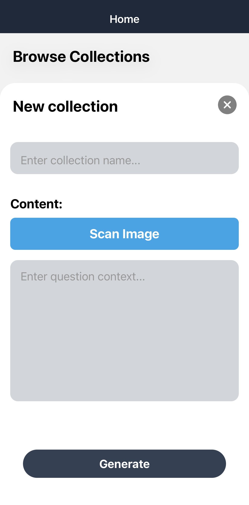
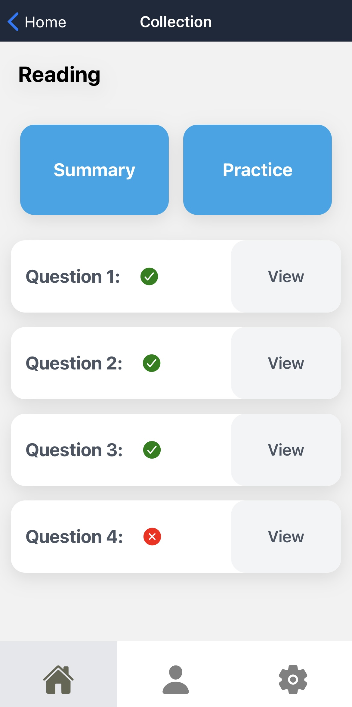
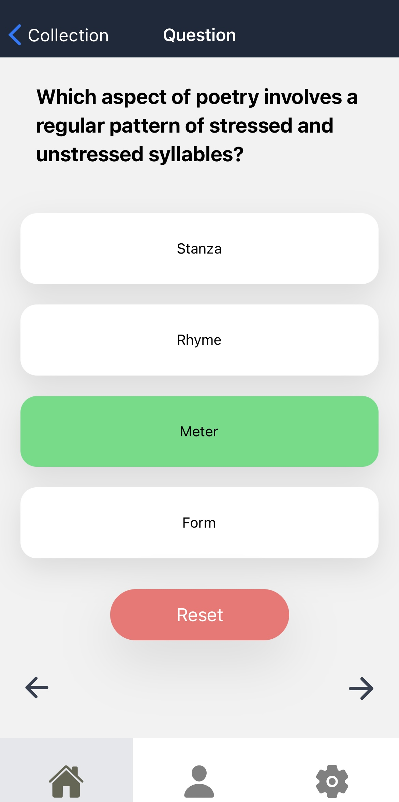
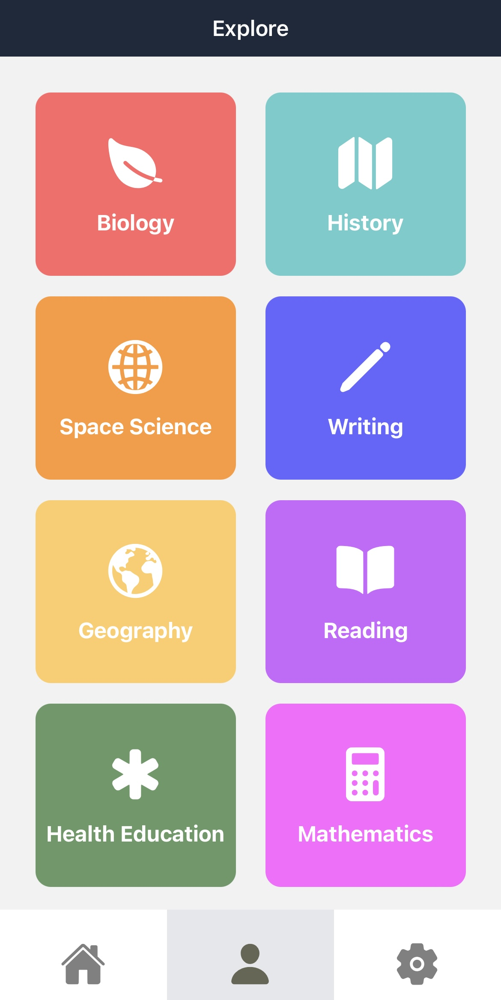

# KRAM 
KRAM is a study tool designed to help students generate practice problems based on concepts they're learning in class. Users are able to upload pictures of homework sheets and practice problems, and KRAM uses AI to create similar problems.

## Technologies

### Overview
The frontend is built using React Native and Tailwind CSS. Firebase is used for authentication and storing user collections. Google Vision is used to scan images for text. Google Gemini 1.0 Pro is used to generate practice problems.

## Features
### Scan Worksheets
In the "Create new collection" section, users specify the name of their collection and upload images of their worksheets. These images serve as context for their generated problems. Users can also manually enter context, as well as change the context scanned from the image before generating.

### Collections
Within each collection are generated summaries describing the concepts covered in the generated problems. Closely related topics are also provided. Each collection has generated multi-choice practice problems.

  
  

### Explore
In the explore tab, we have provided users with various subjects to create collections on. Each subject has a topic summary, and adding these collections will generate problems with the topics described.

  
  

